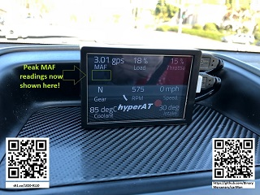

# carMon

  ATTN - runs fullscreen by default - triple click or triple tap to exit the app (or click/tap *many* times if high load...).
<li>  Double tap for special actions (resets peakMAF as of 2/2/02)
<li>  Single tap cycles screens (including details of view ECU codes read.)
<li>  Touch and hold - tbd

  Fork of Geoffrey Wacker's (GW) Cal Poly SLO project, initially for M3 but will be adapting to IS300 and making more generic/portable as time permits.
(See https://digitalcommons.calpoly.edu/cpesp/235)

  N.B./nota bene/ATTENTION: Generic OBD2/ISO-9141-2 (and even M-VCI) is NOT a realtime system, as is noted be the original author RE using this display:

  From GW's PDF, _"As for the hardware, I’d like to transition from the Raspberry Pi 3 to a Raspberry Pi Zero W.  I have no need for the extra processing power that the Pi 3 provides, so the Zero W would be a great choice due to its extremely small form factor and even lower cost.  I’d also like to explore the possibility of directly connecting to the vehicle’s CAN (controller area network) bus instead of OBD-II.  The response time of OBD-II is somewhat lacking, and it can take up to a second to get new data.  This is acceptable for data that doesn’t change often like temperatures, but terrible for things like RPM, throttle position, and speed.  Connecting directly over CAN would hopefully eliminate the response time issues, and would open up the door to actually controlling things in the car that communicate over CAN bus (lock the doors, switch on lights, etc.)." -- GW_

  With this first commit (33c824f), we have the same proof of concept level as posted by GW.  I've added adapted images and will be modding/enhancing the code to do thresholding, warnings, etc.   Metric watermarking (done for MAF in 75c88c65) comes to mind (like a good AEM), among others.  Another major (circa 1baeb92c) is for dealing with a single code, the dreaded P0446 (or maybe multi P044X codes?).  On the gen1 is300 a high-flow exhaust can cause enough heat to trip P044X send codes, or even damage the gas cap.  This could generate a constant cry-wolf Vapor CEL situation that might leave you ignoring a serious code.  With this code-set, if that is the only DTC found, an auto-clear option in the config will allow the Pi carMon to clear that Maintenance Indicator Light (MIL).  It's worth noting that in California, you can ONLY have a Vapor Canister pending code BUT not a CEL... (and is the only "incomplete" monitor allowed).  Any/all codes, will be displayed on the second screen of carMon as GW intended.

  After hacking the web-posted code into a working state (cursed html characters, indentation, missing part of log.py, etc.), I tested with the trusty Mini-Vci/M-vci interface cable (Toyota J2354).  The M-VCI cable is not an ELM327 device, afterall, and will not work as-is (if specs/python class can be made to work at all?).  Pity, as I noticed when using the M-VCI cable with TIS Techstream Diagnostic Cable Toyota Firmware V1.4.1, there are many desirable PIDs not seen on my other scanners (or more likely, a deeper scanning library as seen in ./library/tbd_powertrain.api).  One important value is the ATF temperature.  I've installed a dedicated physical analogue gauge but want to make a thermostat routine in this carMon code to watch ATF fluid temperature and run a fan-tapped relay at a LUT'd duty cycle.

  I've tested against an ecu emulator and in-car with both my ScanTool OBDLink SX 425801 cable and a cheap (but safe) elm327 Bluetooth.  On a side note, some issue (library or maybe a defective cable register?) has shomehow caused a pending P0440 code to mis-read as a C0XXX code - I verified with several other scanners for sanity and will see of the bluetooth elm327 finds the same mismatch before messing with carMon code on the matter.
  
  Anyway, thanks _internet_, github, python-ODB, and thanks especially GW for the great starting point.  Please feel free to download/distribute this project, with no warranties for intended use of any kind.  This code is free per GNU/GPL/Digital commons and unsupported.  For those wanting to shortcut the learning experience, I can mail a disk-dumped pi 3B+ ready raspbian OS on sd card with this code and its ~frozen dep's pre-installed, leaving your to only worry about hardware integration, $20USD paypal or any ebay/amazon gift card.

  For those aware of my isfootsi hyperAT https://dynotag.com/1020-9115 installed in https://dynotag.com/1020-9116, that source code remains copyright of my LLC. (sorry, too much work went into designing a safe but performant algo for that).
  
  Voila, içi! https://github.com/BinaryMercenary/carMon/blob/master/images/art/SampleInstall.jpg
